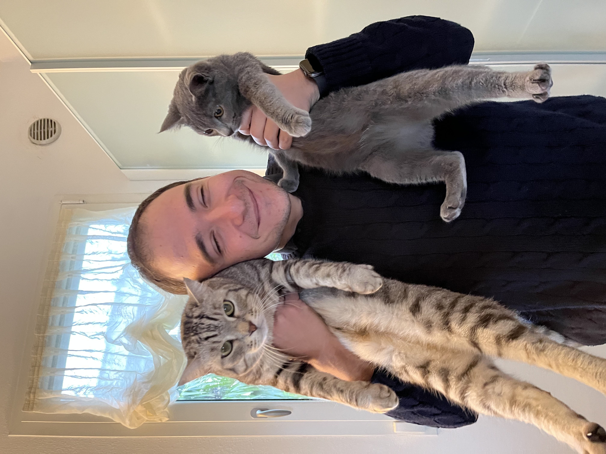

<table>
<tr>
<td width="240" valign="top">

</td>
<td valign="top">

**Ludovico Cesaro**  
Software engineer. I build agents that do real work on a Mac, and I keep the interesting bits on the disk.

Bucharest, via Padova. Agentic AI at [METRO Digital](https://www.metro.digital/). Open source as **vidoluco**, never the work account.

</td>
</tr>
</table>

## Selected

**[lightweight-rec](https://github.com/vidoluco/lightweight-rec)**  
Option+R. One display, the microphone, Whisper on the machine, a Markdown note in the vault you already use. Nothing leaves unless you ask.

**[query-sanitizer-mcp](https://github.com/vidoluco/query-sanitizer-mcp)**  
A local model redacts a prompt before it reaches someone else's API. The agent keeps its tools. The secrets stay home.

**[gfn-overlay](https://github.com/vidoluco/gfn-overlay)**  
A macOS overlay that watches the game and talks back from a vision model running locally. Same rule: the pixels do not go to the cloud.

## Elsewhere

[LinkedIn](https://www.linkedin.com/in/ludovicocesaro/) · [this GitHub](https://github.com/vidoluco)
